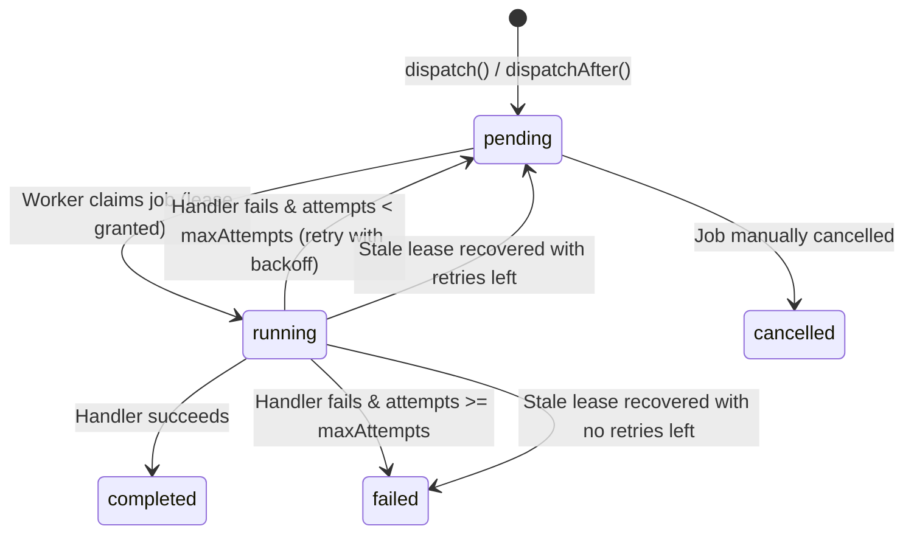

# Architecture & Technical Design

PHP SimpleQueue is a framework-agnostic background job processing library built on a **two-layer engine model**. This guide documents its conceptual model, state machine, claim fencing, repair mechanisms, and internal structures.

---

## Two-Layer Model

SimpleQueue strictly separates **Persistence** (Job Storage) from **Notification & Ordering** (Queue Driver).

```
+-------------------------------------------------------------------+
|                            APPLICATION                            |
+-------------------------------------------------------------------+
       |                                              ^
       | dispatch()                                   | handle()
       v                                              |
+----------------------+                      +---------------------+
|    JobDispatcher     |                      |       Worker        |
+----------------------+                      +---------------------+
   |                |                            |                |
   | 1. Persist     | 2. Notify                  | 3. Claim       | 4. Ack / Release
   v                v                            v                v
+----------------------+                      +---------------------+
|  JobStorageInterface |                      | QueueDriverInterface|
| (Pdo / InMemory)     |                      | (Redis / DB / Mem)  |
|                      |                      |                     |
| * Authoritative      |                      | * Notification &    |
| * State transitions  |                      |   Ordering only     |
| * Leases & progress  |                      | * Volatile / Ephem  |
+----------------------+                      +---------------------+
```

### Key Invariants

1. **Storage is Authoritative**: Job data, status transitions, attempt counts, execution payloads, lease tokens, and results live exclusively in `JobStorageInterface` (e.g. PDO MySQL/PostgreSQL/SQLite or `InMemoryJobStorage`).
2. **Drivers are Delivery Notifications**: `QueueDriverInterface` (Redis/Valkey, Database polling, or In-Memory) provides notification, priority/FIFO ordering, and worker wake-ups.
3. **Dual-Write Safety**: If a storage insert succeeds but queue notification fails, the system recovers automatically via `QueueReconciler`. Redis failure never corrupts job state.

---

## Job Lifecycle State Machine

Jobs move through five explicit states defined in `Oeltima\SimpleQueue\Contract\JobStatus`:



### State Definitions

| Status | Description |
|---|---|
| `pending` | Job is created and waiting to be claimed. May have a future `available_at` timestamp for scheduled dispatch. |
| `running` | Job has been claimed by a worker with an active `worker_id` and unique `lease_token`. |
| `completed` | Terminal state. Job finished successfully; result payload is stored. |
| `failed` | Terminal state. Job exhausted all retry attempts or suffered an unrecoverable failure; error message is stored. |
| `cancelled` | Terminal state. Job was cancelled prior to or during execution. |

---

## Leases & Claim Fencing

SimpleQueue enforces **at-least-once delivery with optimistic claim fencing**:

1. **Claiming**: When a worker dequeues a job ID, it issues a fenced claim to storage (`claimNextAvailable()` or `claimById()`). Storage assigns a `worker_id`, generates a fresh `lease_token`, and sets `locked_at`/`started_at` to the current timestamp. Claiming does not increment `attempts`; `attempts` counts failed executions already consumed and the current ordinal is `attempts + 1`.
2. **Fenced Updates**: Every state update (`markCompleted()`, `markFailed()`, `scheduleRetry()`, `updateProgress()`) MUST pass the exact `ClaimedJob` token. If another worker reclaimed the job due to a lease expiration (e.g. network stall or worker crash), the original worker's update is rejected with an `OwnershipOutcome::Lost` / `lost_ownership` event.
3. **Progress Heartbeat**: Long-running jobs update their lease by calling progress callbacks (`$progress($percent, $message)`), extending their active lease window.

---

## Scheduled Dispatch & Delayed Promotion

Jobs can be scheduled for future execution using `dispatchAfter()`, `dispatchAt()`, or `$availableAt`:

- **Database Storage**: The storage row contains `available_at`. Database polling queries gate on `WHERE available_at <= NOW()`.
- **Redis Driver**: Delayed jobs are placed in a Redis Sorted Set (`ZSET`) scored by unix timestamp. Before popping from the pending list, workers (or reconciliation passes) run an `EVALSHA` Lua script (`promoteDelayed()`) to move due jobs from the `ZSET` to the pending `LIST`.

---

## Bounded Queue Repair (`QueueReconciler`)

`QueueReconciler` automatically repairs inconsistency between storage and drivers:

- **Unnotified Jobs**: Identifies `pending` jobs in storage that lack notifications in the queue driver and re-enqueues them.
- **Stale Running Leases**: Stale `running` lease recovery (`locked_at + stuck_job_ttl < NOW()`) is a separate Worker/storage responsibility that retries (`running -> pending`) or fails (`running -> failed`) with one consumed attempt and the canonical stale error; `QueueReconciler` does not own it.
- **Bounded Execution**: Reconciliation processes jobs in bounded pages (default 100 rows per pass) to ensure zero impact on production latency.

---

## Backend Parity Summary

| Feature | PDO Storage + Redis Driver | PDO Storage + DB Driver | InMemory (Testing) |
|---|---|---|---|
| **Storage Backend** | MySQL / Postgres / SQLite | MySQL / Postgres / SQLite | In-Memory Array |
| **Notification Layer** | Redis / Valkey List & ZSET | Database Polling | SplQueue / Arrays |
| **Delivery Model** | At-least-once | At-least-once | At-least-once |
| **Scheduled Dispatch** | Redis ZSET promotion | SQL `available_at` predicate | Timed sorted array |
| **Concurrency Fencing** | `FOR UPDATE SKIP LOCKED` / RETURNING | `FOR UPDATE SKIP LOCKED` / RETURNING | Array lock mutation |
| **External Dependencies** | PDO + `predis/predis` | PDO only | None |

---

## Job Definition Array Shape (`JobDefinitionShape`)


Batch job creation in `JobStorageInterface::createJobs()` expects an array of typed dictionaries structured according to `@phpstan-type JobDefinitionShape`:

```php
[
    'type' => 'email.welcome',                            // (string, required) Registered handler identifier
    'payload' => ['user_id' => 42, 'email' => 'a@b.com'], // (array, required) Serializable payload
    'queue' => 'default',                                 // (string, optional) Queue name (default: 'default')
    'maxAttempts' => 3,                                   // (int, optional) Retry limit (default: 3)
    'requestId' => 'req_abc123',                          // (string|null, optional) Idempotency correlation key
    'availableAt' => 1770000000,                          // (int|DateTimeInterface|null, optional) Scheduled timestamp
]
```

